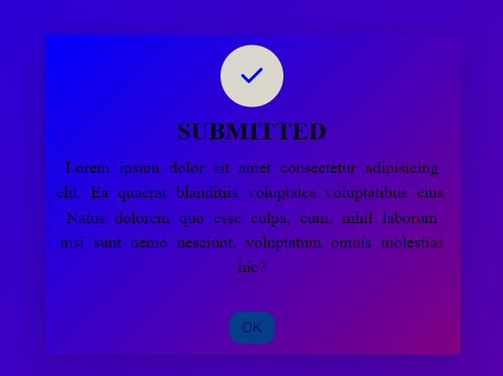

# Popup 

This project demonstrates how to create a popup alert modal with HTML, CSS, JavaScript, and Font Awesome icons. 

---

## Demo

Open the project click  [here](https://naveenkumar-developer.github.io/popupAlert/)



---

## Features ✨

- **Popup Modal**: A sleek, centered popup alert.

- **Interactive**: Opens  smoothly using JavaScript events.

- **open functionality**: Allows users to open the popup with a submit button.

- **Close functionality**: Allows users to dismiss the popup with a ok button.


## Project Structure

```bash
/project-root
│
├── index.html
├── styles.css
├── script.js
└── README.md
```
---

## Acknowledgements ⭐

- Icon used in this project come from **font awesome** icon.


